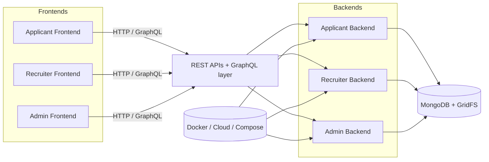
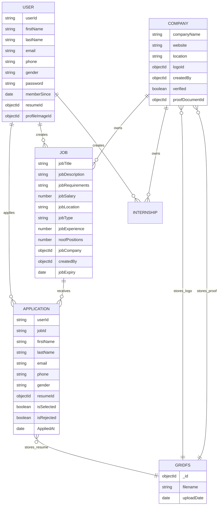
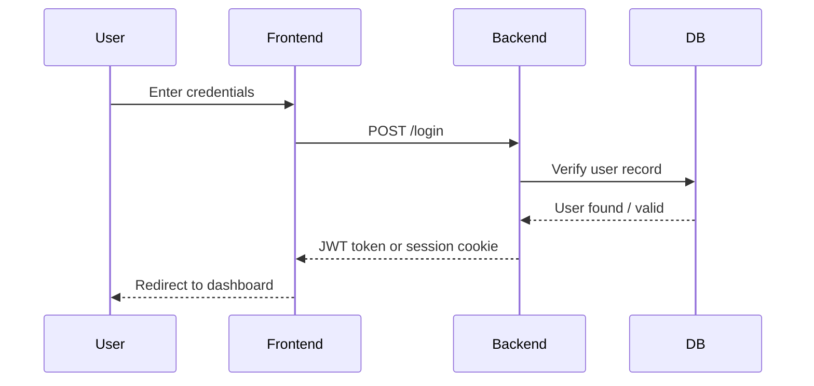
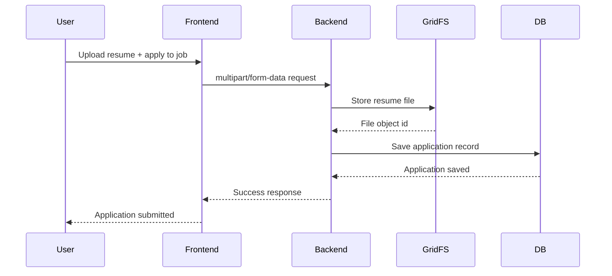
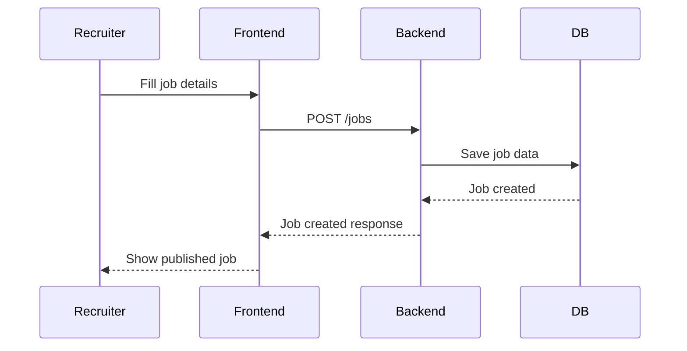
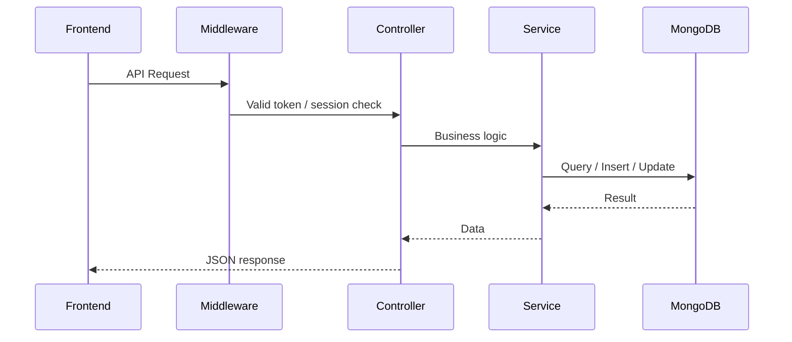
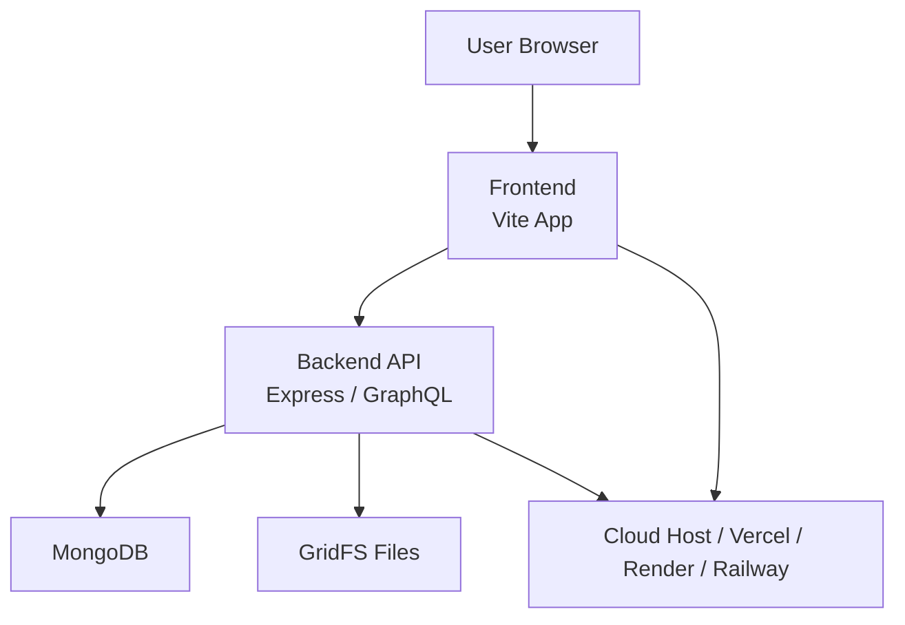

# GoHire

GoHire is a multi-tenant hiring platform monorepo with three separate product modules:

- Admin portal
- Applicant portal
- Recruiter portal

Each module is built as a frontend + backend pair, connected to MongoDB for persistence and using modern Node.js APIs for business logic.

## Project overview

This repository is organized as a monorepo under the `goHire/` directory, with each product separated into its own application stack.

```text
GoHire/
├── README.md
├── docker-compose.yml
├── render.yaml
├── package.json
├── goHire/
│   ├── admin/
│   │   ├── backend/
│   │   └── frontend/
│   ├── applicant/
│   │   ├── backend/
│   │   └── frontend/
│   ├── recruiter/
│   │   ├── backend/
│   │   └── frontend/
│   └── scripts/
└── test-reports/
```

## Tech stack

### Frontend
- React + Vite
- Tailwind CSS
- PostCSS
- HTML + JavaScript

### Backend
- Node.js
- Express.js
- REST APIs
- GraphQL support in backend layers (`graphql/` folders)

### Database
- MongoDB
- GridFS for storing large files such as resumes and uploaded documents

### Authentication
- Admin backend uses session-based auth
- Applicant and recruiter backends use JWT-based auth via Bearer tokens

### Deployment
- Docker and Docker Compose
- Cloud platform configs include `render.yaml` and `railway.toml`
- Frontend deploy config via `vercel.json`

---

## High-level architecture

The system is designed as a set of independent but related application modules. Each module speaks to a MongoDB database and owns its own user flows and business logic.



### How the components interact
- The frontend sends requests to the backend through REST routes or GraphQL resolvers.
- The backend validates the request, checks auth, processes business logic, and interacts with MongoDB.
- Large files such as resumes are stored using GridFS instead of raw document fields.
- The admin, recruiter, and applicant modules are functionally separated but all share the same platform style and database pattern.

---

## Database schema

The project follows a MongoDB document model with several key collections and file references. The schema definitions below reflect the actual model files in the repo.

### GridFS file storage
The project stores uploaded files using MongoDB GridFS. This is especially relevant for resumes and proof documents.

Typical storage pattern:
- `uploads.files`
- `uploads.chunks`

Files are referenced by `ObjectId` from individual document schemas such as:
- `resumeId`
- `profileImageId`
- `logoId`
- `proofDocumentId`

### Relationship diagram


---

## Request/data flow

### 1. User login flow



### 2. Job application flow



### 3. Recruiter creates a job



---

## Module-wise architecture

### 1) Admin module
**Location:** `goHire/admin/`

Responsibilities:
- Internal administration workflows
- Management of platform data
- Monitoring or administrative operations
- Session-based secure access

Key folders:
- `admin/backend/app.js` — entry point for backend
- `admin/backend/controllers/` — request handlers
- `admin/backend/routes/` — API routes
- `admin/backend/graphql/` — GraphQL server and schemes
- `admin/backend/models/` — database models
- `admin/backend/middleware/` — auth / validation / error handling
- `admin/backend/db/` — DB helpers and GridFS integration

### 2) Applicant module
**Location:** `goHire/applicant/`

Responsibilities:
- User-facing job search and application flow
- Profile creation and job-related actions
- User authentication via JWT
- Resume upload and application tracking

Key folders:
- `applicant/backend/app.js`
- `applicant/backend/config/`
- `applicant/backend/controllers/`
- `applicant/backend/models/`
- `applicant/backend/middleware/auth.js`
- `applicant/backend/db/`

### 3) Recruiter module
**Location:** `goHire/recruiter/`

Responsibilities:
- Recruiter dashboard
- Managing jobs and internships
- Viewing and managing applications
- Premium-related and recruiter workflows

Key folders:
- `recruiter/backend/app.js`
- `recruiter/backend/controllers/`
- `recruiter/backend/models/`
- `recruiter/backend/cron/`
- `recruiter/backend/services/`
- `recruiter/backend/middleware/auth.js`

---

## Database architecture

The project uses MongoDB as the main persistence layer. The model files show entity-driven design for job seeker and recruiter workflows.

### Important entities / collections

#### Applicant-side models
- `user.js`
- `Application.js`
- `Applied_for_Internships.js`
- `Applied_for_Jobs.js`
- `premium_user.js`
- `Receipt.js`

#### Recruiter-side models
- `User.js`
- `Companies.js`
- `Jobs.js`
- `Internship.js`
- `AppliedJob.js`
- `AppliedInternship.js`
- `PremiumUser.js`

### Typical relationships
- User → Applications
- Job → Multiple Applications
- Company → Multiple Jobs
- Recruiter → Multiple Job/Internship postings
- Application → refers to resume file stored in GridFS

### Example relations
```text
Applicant User 1 --- N Applications
Job 1 --- N Applications
Company 1 --- N Jobs
Recruiter 1 --- N Jobs
Application references resume file in GridFS
```

---

## Authentication and authorization

### Admin auth flow
- Uses session-based authentication.
- Middleware checks `req.session.user` before allowing access.
- This pattern is visible in `goHire/admin/backend/middleware/auth.js`.

### Applicant auth flow
- Uses JSON Web Tokens (JWT).
- Client sends `Authorization: Bearer <token>`.
- Token is verified and attached to the request object.
- Middleware checks validity before continuing.

### Recruiter auth flow
- Uses JWT verification for authenticated requests.
- Token can be passed in Authorization header, and in some cases via query parameter for direct access to protected resources.
- User is loaded from DB and attached to `req.user` before route handlers run.

### Authorization pattern
- Auth middleware protects routes.
- Additional checks such as admin-only access are implemented with dedicated middleware functions.

---

## API flow

A typical request follows this flow:

```text
Frontend request
  -> Route definition
  -> Middleware (auth / validation / error handling)
  -> Controller
  -> Service layer / business logic
  -> Model / MongoDB interaction
  -> GridFS (if file upload)
  -> Response to frontend
```

### Example API flow


---

## Architectural decisions and justification

### Why this structure?
- Separate modules for Admin, Applicant, and Recruiter keep the product domain boundaries clean.
- Frontend and backend separation improves maintainability and independent deployment.
- MongoDB is suitable because the data model is document-based and evolves during product development.
- GridFS is used for large uploaded documents such as resumes.
- JWT for applicant/recruiter APIs provides stateless auth for client-driven interactions.
- Session auth in admin keeps admin flows simpler and more server-oriented.

### Why Docker / Compose?
- It makes local development and deployment consistent across services.
- It enables each service to run with its own port and environment configuration.

---

## Scalability and performance

The system is built in a way that can scale with increasing traffic.

### Current scalability considerations
- Stateless backend services can be horizontally scaled behind a load balancer.
- MongoDB can be scaled with replication and indexing for production workloads.
- GridFS can be optimized for large uploads and file handling over time.
- Redis-style caching can be introduced for frequent reads like job listings.
- Background jobs can be added for non-blocking tasks such as email, notifications, or cleanup.

### Possible future optimizations
- Redis for caching
- Queue-based async processing
- Read replicas for MongoDB
- Object storage for large file handling at enterprise scale

---

## Failure handling

The project already includes practical failure boundaries:
- Route-level validation
- Middleware-driven auth checks
- Centralized error handling patterns
- File upload logic with GridFS for robust document handling

### Typical failure scenarios
- Invalid or expired token -> 401 response
- Missing auth session -> access denied
- DB failure -> backend returns structured error response
- File upload issue -> request fails before final application is saved

---

## Deployment architecture

The repository includes Docker files and deployment configs for cloud hosting.



### Observed deployment setup
- Docker Compose orchestrates backend/frontend services
- `render.yaml` and `railway.toml` indicate cloud deployment support
- `vercel.json` suggests frontend deployment configuration

---

## Local development

### Prerequisites
- Node.js
- npm
- MongoDB running locally or through MongoDB Atlas

### Install dependencies

Run the following in each service folder:

```bash
cd goHire/admin/backend && npm install
cd goHire/admin/frontend && npm install

cd goHire/recruiter/backend && npm install
cd goHire/recruiter/frontend && npm install

cd goHire/applicant/backend && npm install
cd goHire/applicant/frontend && npm install
```

### Example environment variables

#### Admin backend
```env
PORT=9000
MONGO_URI_ADMIN=mongodb://localhost:27017/admin_db
MONGO_URI_RECRUITERS=mongodb://localhost:27017/recruiter_db
MONGO_URI_APPLICANT=mongodb://localhost:27017/applicant_db
SESSION_SECRET=admin-secret-key-change-me
FRONTEND_URL=http://localhost:5173
```

#### Applicant backend
```env
PORT=3000
MONGO_URI=mongodb://localhost:27017/applicant_db
FRONTEND_URL=http://localhost:5174
JWT_SECRET=your-secret-key
```

#### Recruiter backend
```env
PORT=5000
MONGO_URI=mongodb://localhost:27017/recruiter_db
FRONTEND_URL=http://localhost:5175
JWT_SECRET=your-secret-key
```

### Run locally

```bash
cd goHire/admin/backend && npm run dev
cd goHire/admin/frontend && npm run dev

cd goHire/applicant/backend && npm run dev
cd goHire/applicant/frontend && npm run dev

cd goHire/recruiter/backend && npm run dev
cd goHire/recruiter/frontend && npm run dev
```

Default ports:
- Admin: `9000` backend, `5173` frontend
- Applicant: `3000` backend, `5174` frontend
- Recruiter: `5000` backend, `5175` frontend

---

## Interview-ready architecture summary

> GoHire is a monorepo containing three modules: Admin, Applicant, and Recruiter. Each module has a separate frontend and backend. The frontends are built with Vite and Tailwind, while the backends run on Node.js and Express and expose REST APIs with some GraphQL support. The system stores structured data in MongoDB and uses GridFS for large uploaded files such as resumes. Admin uses session-based authentication, while Applicant and Recruiter use JWT-based authentication. Requests flow through middleware, controllers, services, and MongoDB models before a response is returned to the frontend. The project is containerized with Docker and can be deployed across cloud providers. This architecture keeps the application modular, makes feature development easier, and allows independent scaling of each product module.

---

## Repository notes

This project includes:
- separate app-level backend and frontend codebases
- MongoDB-based data storage
- JWT/session based auth patterns
- deployment configuration for Docker/cloud hosting
- test report scripts under the project root and `goHire/scripts/`

---

## Conclusion

GoHire follows a practical modular architecture for a multi-portal hiring platform: three product-focused frontend/back-end stacks, a shared MongoDB persistence model, token or session authentication depending on the module, and Docker-based deployment patterns for scalability and maintainability.

This architecture is easy to reason about, easy to deploy, and suitable for evolving business needs without rewriting the system structure.
